# Authentication & Authorization Flows

## 1. OAuth2 로그인 (Login)

사용자가 구글 로그인을 시도하여 Access Token과 Refresh Token을 발급받는 과정입니다.

```mermaid
%%{init: {'theme': 'dark'}}%%
sequenceDiagram
    actor User
    participant Browser
    participant Filter as OAuth2LoginAuthenticationFilter
    participant Google as Google Auth Server
    participant Handler as OAuth2SuccessHandler
    participant Provider as TokenProvider
    participant DB as RefreshTokenRepository

    User->>Browser: 로그인 버튼 클릭 (/api/v1/auth/login/google)
    Browser->>Filter: OAuth2 로그인 요청
    Filter->>Google: 리다이렉트 (Google Login Page)
    User->>Google: 계정 정보 입력 & 승인
    Google-->>Filter: Authorization Code 전달
    Filter->>Google: Access Token 요청 (with Code)
    Google-->>Filter: User Info (Profile) 반환
    
    Filter->>Handler: onAuthenticationSuccess(Authentication)
    
    rect rgb(50, 50, 80)
        note right of Handler: 토큰 생성 및 발급
        Handler->>Provider: createAccess(TokenClaims)
        Provider-->>Handler: Access Token
        Handler->>Provider: createRefresh(TokenClaims)
        Provider-->>Handler: Refresh Token
    end

    Handler->>DB: Refresh Token 저장
    Handler-->>Browser: JSON Response (Access + Refresh Token)
```

---

## 2. API 요청 및 인가 (Authorization)

발급받은 Access Token을 사용하여 보호된 API 리소스에 접근하는 과정입니다.
`OAuth2AuthenticationFilter`가 요청을 가로채어 토큰을 검증하고 인증 객체를 생성합니다.

```mermaid
%%{init: {'theme': 'dark'}}%%
sequenceDiagram
    actor Client
    participant Filter as OAuth2AuthenticationFilter
    participant Provider as TokenProvider
    participant Blacklist as ExpiredTokenPort
    participant Context as SecurityContextHolder
    participant Controller as PostWebAdapter

    Client->>Filter: GET /api/v1/posts (Header: Authorization)
    
    Filter->>Filter: resolveToken(request)
    
    rect rgb(50, 80, 50)
        note right of Filter: 1. 토큰 검증 & 파싱
        Filter->>Provider: verify(token)
        alt Token Invalid/Expired
            Provider-->>Filter: Throw Exception
            Filter->>Context: clearContext()
            Filter-->>Client: 401 Unauthorized (via EntryPoint)
        else Token Valid
            Provider-->>Filter: Token (with Claims)
        end
    end

    rect rgb(80, 50, 50)
        note right of Filter: 2. 블랙리스트 확인
        Filter->>Blacklist: isExpired(token)
        alt Token is Blacklisted
            Blacklist-->>Filter: True (Logout된 토큰)
            Filter-->>Client: 401 Unauthorized
        end
    end

    rect rgb(50, 50, 80)
        note right of Filter: 3. 인증 객체 생성 및 저장
        Filter->>Filter: UserPrincipal 생성 (from Claims)
        Filter->>Filter: Authentication 객체 생성
        Filter->>Context: setAuthentication(auth)
    end

    Filter->>Controller: chain.doFilter()
    Controller-->>Client: 200 OK
```

---

## 3. 로그아웃 (Logout)

Access Token을 블랙리스트에 등록하고, Refresh Token을 삭제하는 과정입니다.

```mermaid
%%{init: {'theme': 'dark'}}%%
sequenceDiagram
    actor User
    participant API as AuthenticationWebAdaptor
    participant Service as AuthenticationCommandService
    participant Provider as TokenProvider
    participant Blacklist as ExpiredTokenPort
    participant RefreshStore as RefreshTokenPort

    User->>API: DELETE /api/v1/auth/logout<br/>(Header: AccessToken, RefreshToken)
    API->>Service: logout(command)
    
    rect rgb(50, 50, 80)
        note right of Service: 1. 토큰 검증
        Service->>Provider: verify(AccessToken)
        Provider-->>Service: Token (Valid)
        Service->>Provider: verify(RefreshToken)
        Provider-->>Service: Token (Valid)
    end

    rect rgb(80, 50, 50)
        note right of Service: 2. Access Token 블랙리스트 등록
        Service->>Blacklist: expire(AccessToken)<br/>(TTL: 남은 유효시간)
    end

    rect rgb(80, 80, 50)
        note right of Service: 3. Refresh Token 삭제
        Service->>RefreshStore: expire(RefreshToken)
    end

    Service-->>API: void
    API-->>User: 204 No Content
```

